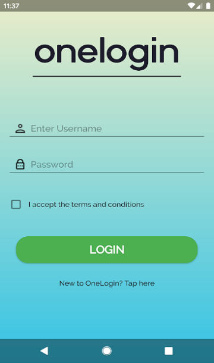
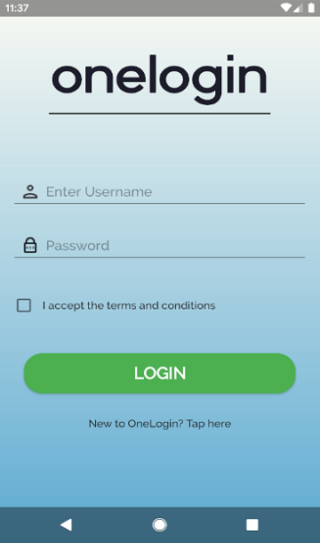

# AwesomeLogin

   

This app has a single login screen with no functionality. Actually the purpose is to build a login screen that has gradient animation
which is very similar to the Instagram app. The gradient comes with 3 different flavors.